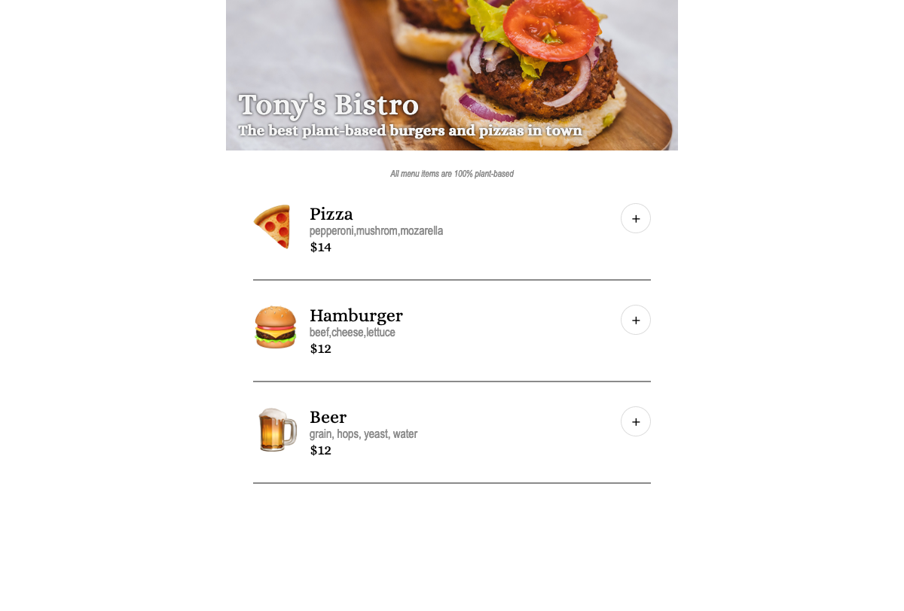
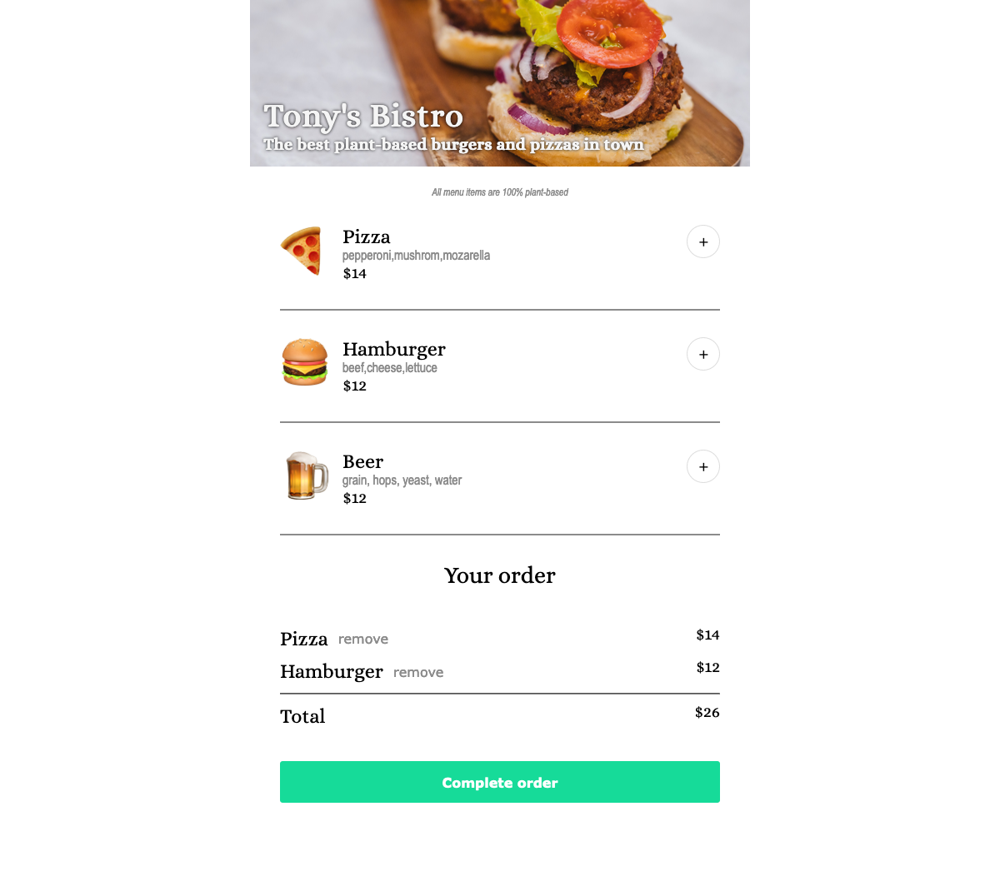
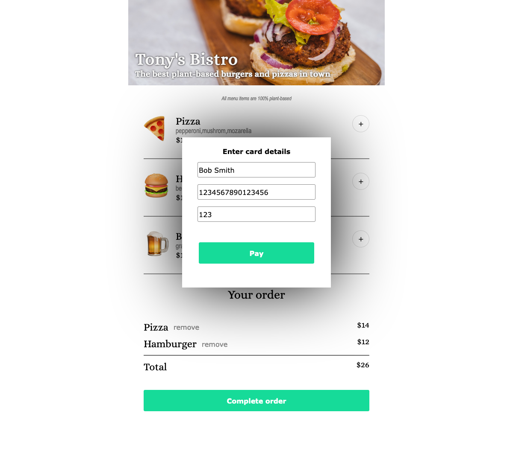
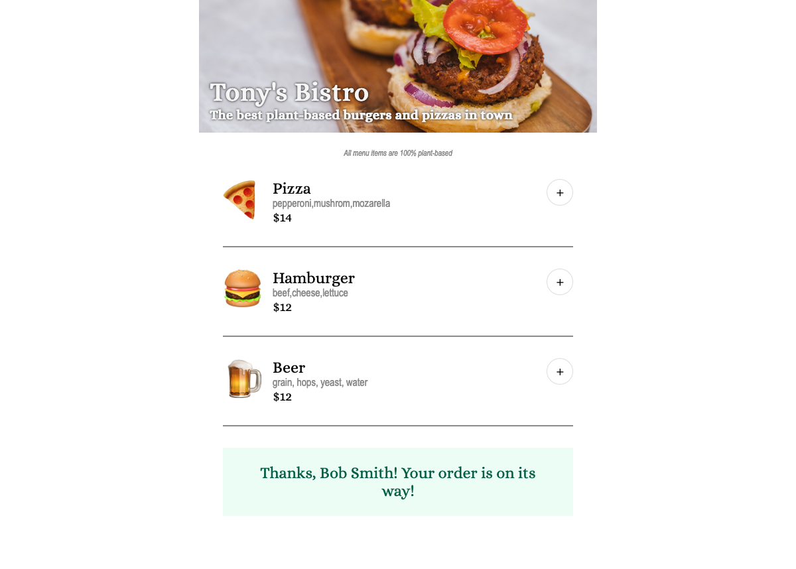
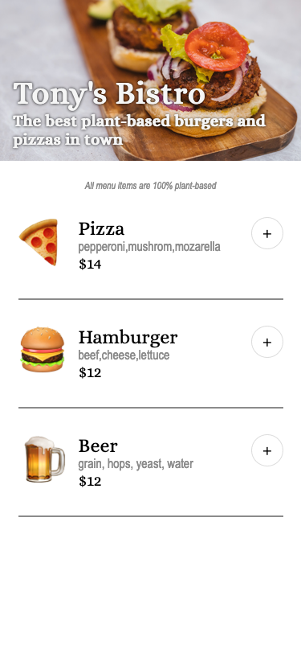
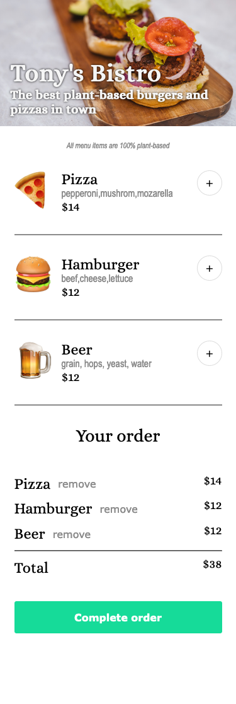
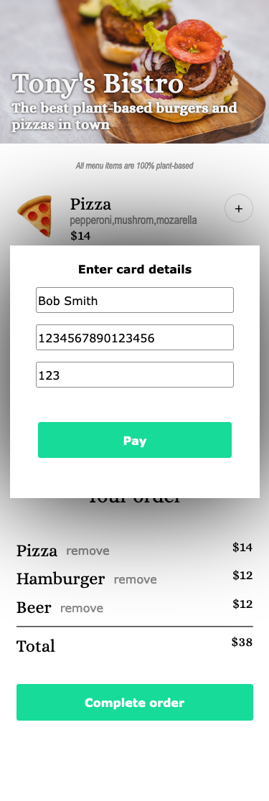
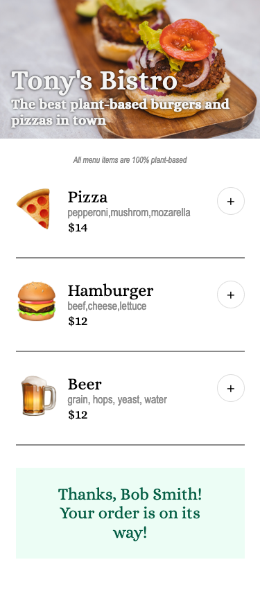

# Restaurant Ordering App

A restaurant ordering app with the ability to add/remove items and accept payment methods.

## Contents 

- [Overview](#overview)
- [Screenshots](#screenshots)
  - [Desktop](#desktop)
  - [Mobile](#mobile)
- [My Process](#my-process)
  - [Built with](#built-with)
- [Status](#status)
- [Connect](#connect)

## Overview

This is my solo project from [Module 5 of Scrimba's Frontend Career Path](https://scrimba.com/learn/frontend). The requirements of the project include:
- Following the design specfications (as indicated in [the provided Figma file](https://www.figma.com/file/Hdgwo69Dym9vVsxbuPbl0h/Mobile-Restaurant-Menu?node-id=0-1&t=yVkBjcFUFMOYOjx6-0)) (with some creative license allowed)
- Render the menu options using JavaScript
- Be able to add/remove items
- Have a payment modal with compulsory form inputs

## Screenshots

### Desktop

### Mobile

## My Process

The design of this app uses a column layout so I took advantage of using `flexbox` to keep things nice and tidy -- both for large and small screens. This helped to eliminate the need for media queries and keep things simple.

Once the design was set in place, I started using JavaScript to manipulate the DOM to meet the requirements of rendering the menu, add/remove items, and accepting payments. For this I used the following technqiues: 
- Use of the [data attributes](https://developer.mozilla.org/en-US/docs/Learn/HTML/Howto/Use_data_attributes) in HTML elements
- Use of array to collect selected order items
  - This helped in rendering the order items list, removing items, and calculating the total
- Functional programming to break down different tasks:
  - Generate menu HTML
  - Generate order HTML
  - Render menu and order
  - Calculate order total
  - Add/remove items
  - Accept payment
- JavaScript Array methods: `forEach()`, `.splice()`, `.findIndex()`, `.push()`

### Built with

- HTML
- CSS
- JavaScript

## Status

A live version can be viewed at: https://ananfito.github.io/restaurant-ordering-app/.

## Connect

Thank you for reading about this project. If you'd like to connect with me for mentoring, collaboration, or employment opportunities, you can do so via the following links:

- [Email](https://anthonynanfito.com/contact/)
- [LinkedIn](https://linkedin.com/in/anthonynanfito)
- [Portfolio](https://ananfito.github.io)
- [Blog](https://ananfito.hashnode.dev)
